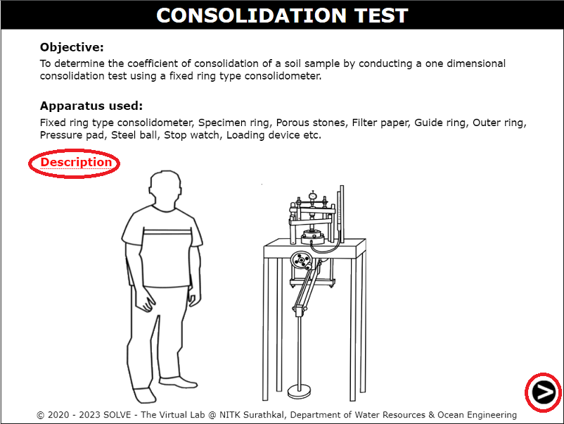
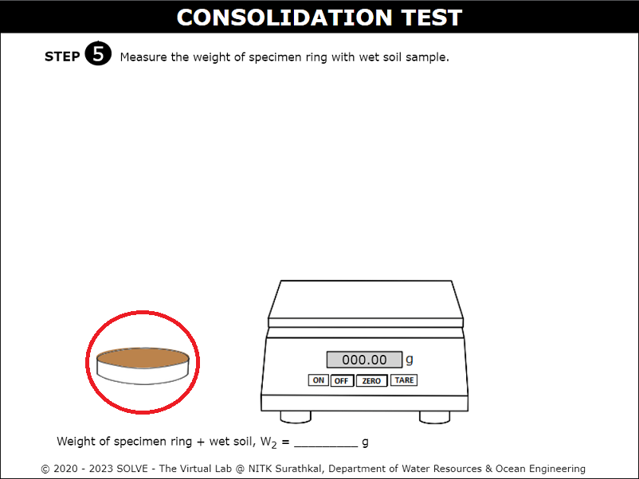
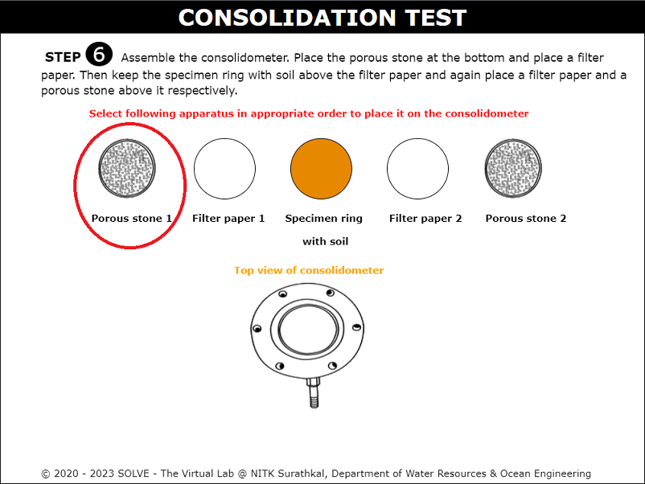
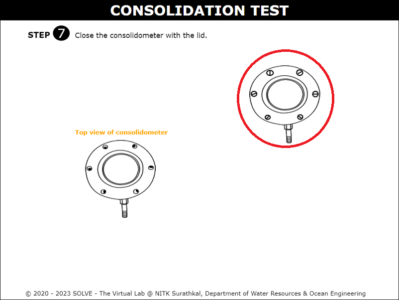
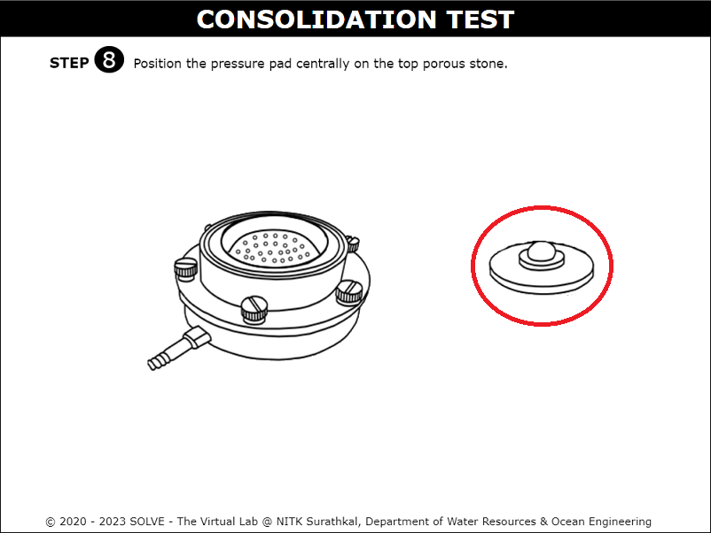
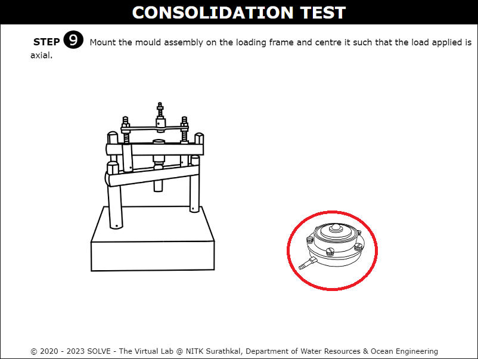
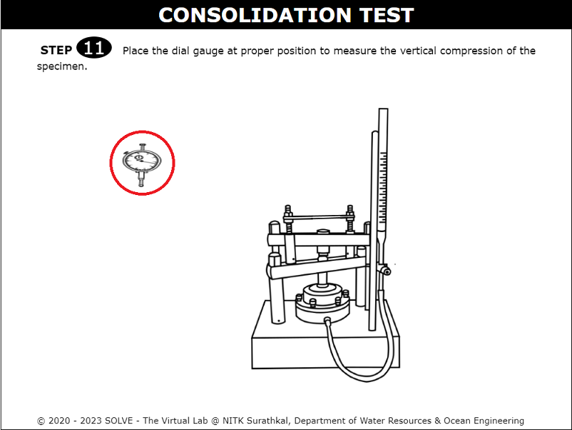
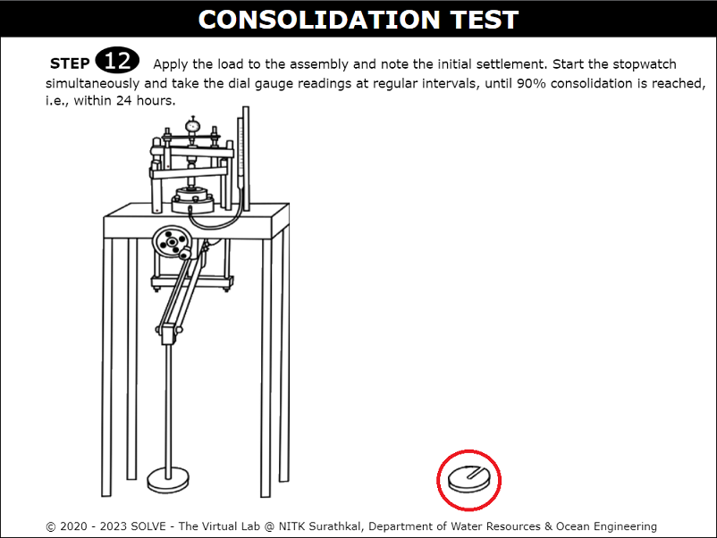
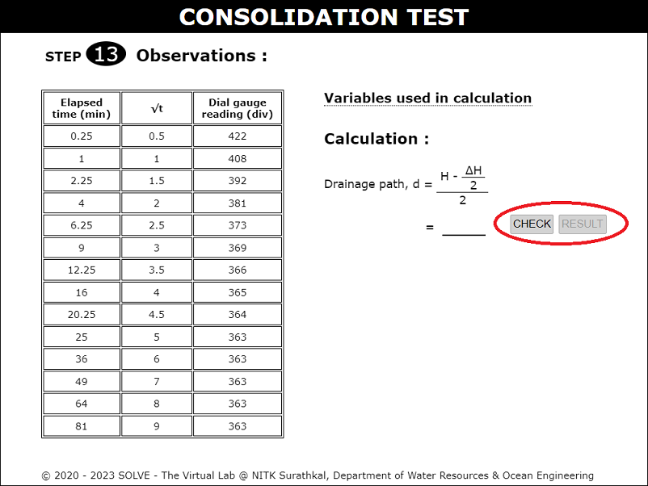

#### The following procedure steps will be followed on the Liquid Limit test simulator

1.	Click on the simulation tab of Consolidation test experiment. The following window will be displayed. Hover on the description icon to see a brief information about the experiment. 
 

2. Click on the measuring jar to add water to the soil sample . 
 

3. After the water is added click on the trowel to mix the soil with water until a fine paste is formed. 
 

4. Click on the porous stone to submerge them in distilled water prior to conduction of experiment. 
 

5.  Saturate the porous stone for 4-8 hours. Click on the next button to proceed further. 
 

6.  Click on the spatula to fill the wet soil sample to the specimen ring. 
 

7.  Click on the ON and TARE button of the weighing machine. Then click on the specimen ring to place it on the weighing machine. 
 

8. Click on the apparatus arranged in order to place it on the consolidometer. 
 

9. After placing all the apparatus click on the lid to close the consolidometer. 
 

10.  Click on the pressure pad to place centrally on porous stone. 
 

11.  After the pressure pad is placed, click on the mould assembly to place it on the loading frame. 
 

12.  Connect the mould assembly to the water reservoir by clicking on the tip of the  pipe. 
 

13.  Click on the dial gauge to place it at the proper position in the consolidation apparatus. 
 

14.  Now apply the load on the assembly by clicking on the load. 
 

15. Simultaneously the stop watch will get started  and the dial gauge readings at regular intervals will be displayed.  
 

16.  Enter the calculated value and give “Check” and “Result” to verify the correct answer. 
 

17.  A characteristic curve for dial gauge reading Vs elapsed time will be displayed. Place the cursor on description to view the procedure followed to plot the graph. 
 

18. Click on Next button to proceed to the final calculation part and to view the inference of the experiment.   
