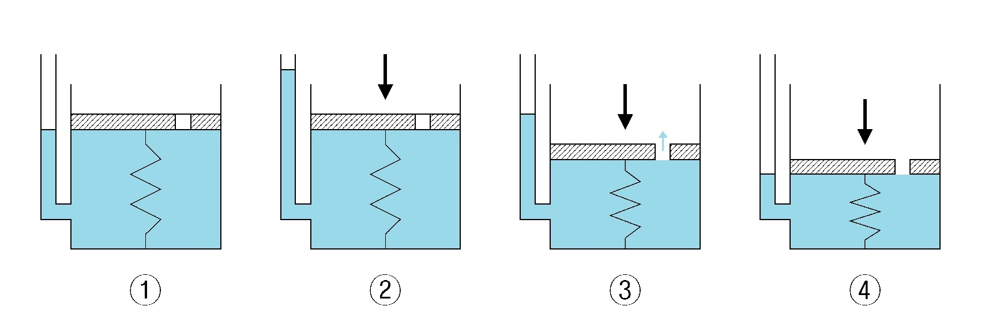

### INTRODUCTION

When a compressive load is applied over a soil mass, a decrease in volume takes place due to the presence of voids in the soil mass.

This decrease in volume can take place by two ways :

#### 1. Due to the expulsion of air voids

This kind of decrease in volume under stress or pressure is known as the compressibility of soil and is a quick process. Here the air voids present in the soil mass gets expelled due to the pressure over it. This phenomenon is called compression.

#### 2. Due to the expulsion of water voids

This is a very gradual process where the water from the voids  present in the soil sample gets expelled. Such a compression resulting from long time static load applied over a saturated soil mass and consequent escape of pore water is termed consolidation.
Consolidation of soil only takes place when the compression of soil has already taken place.

When pore water is present in the soil, some of the stress is taken by it thus decreasing the load on the soil particles. But as the water begins escaping from the voids, the hydrostatic pressure in the soil slowly gets dissipated thus shifting the load to the soil particle increasing the effective stress on the soil particles as a result soil mass decreases in volume.
The rate of escape of pore water from the soil mass completely depends upon the permeability of the soil. If the permeability is high, the rate of consolidation is also high and vice versa.

### Consolidation :

When external stress / load / pressure is applied over a soil mass, the pressure is initially taken up by the water in the pores thereby leading to excess pore water pressure. When the water in the pores is allowed to get out the soil mass, i.e., if drainage is provided, a hydraulic gradient is formed and excess pore water dissipates outside the soil mass. Due to this there will be a gradual transfer of load from the pore water to the soil skeleton due to which they start to rearrange and compress themselves until all the pore water is completely  out of the system.
This process is known as <strong>consolidation</strong> and this phenomenon occurs only in clayey soils.
The process of consolidation can be also explained along with a spring analogy.

  

Schematic diagram of spring analogy

(Source: <a href=" https://upload.wikimedia.org/wikipedia/commons/c/ce/Consolidation_spring_analogy_colored.jpg
">https://upload.wikimedia.org/wikipedia/commons/c/ce/Consolidation_spring_analogy_colored.jpg
</a>)

In the spring analogy, the spring represents the soil structure, and the water in the container represents the pore water in the soil.

<ol style="text-align: justify;">
<li>The first image depicts the condition of the soil mass initially without application of any load or pressure.</li>
<li>In the second image, when a load is applied over the soil mass and if water is not allowed to escape, all the additional load is taken by the pore water as we can clearly see an increase in the piezometric level of the container and also there is no change in the spring structure.</li>
<li>In image 3 and 4 we can notice that when the water is allowed to go out the system, we can see a decrease in the piezometric level as well as the spring structure, which means that when the pore water escapes out of the soil mass the effective stress carried by the soil particles increases.</li>
</ol>

#### Normally consolidated clays and over consolidated clays :

A clay is said to be <strong>normally consolidated</strong> if the effective overburden pressure that it is currently experiencing is the maximum pressure that it has ever experienced till date.

A clay is said to be <strong>over consolidated</strong> if the present overburden effective pressure is less than the highest overburden effective pressure that it has experienced in the past. 

#### Preconsolidation stress :
Preconsolidation stress is defined as the maximum effective stress ever experienced by the soil.
#### Over consolidation ratio :
Over consolidation ratio is defined as the ratio between the preconsolidation stress to that of the present effective stress.

| OCR Value | Type of clay |
| :--: | :--|
|  >1  | Over consolidated clay |
|  1   | Normally consolidated clay |

An indication of the degree to which consolidation characteristics can vary among different soils can be obtained from the list of characteristics for several widely different soils given in Table below.

| Type of soil | Coefficient of consolidation in 10-4 cm2/second |
| :-- | :--:|
|  Mexico city clay (volcanic origin; composed mostly of montmorillonite)  | 0.2 to 2.5 |
|  Boston blue clay (marine deposit of glacial clay, composed partially of illite)  1. Undisturbed  2. Remolded | 10 to 20  1 to 6 |
|Morganza Louisiana clay (fluvial deposit; composed mostly of illite)|0.5 to 1|
|Newfoundland peat|0.2 to 3|
|Maine clay (silty, glacial clay composed partially of illite)|20 to 40|

